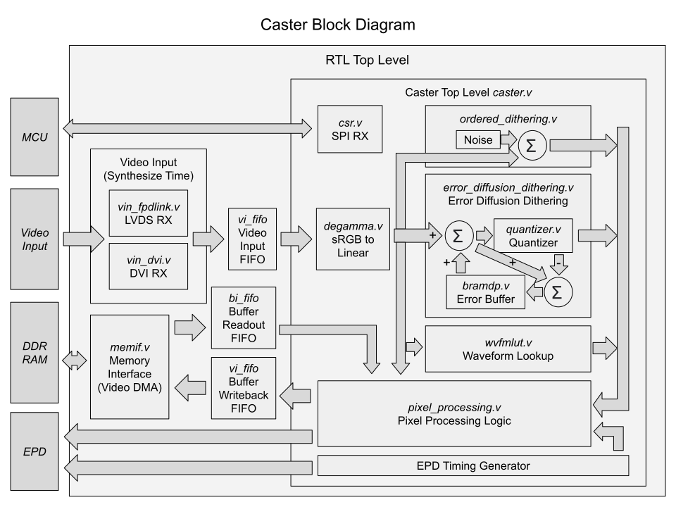

# Caster

The Caster is a open-source FPGA-based low-latency electrophoretics display controller (EPDC) design that can be embedded into multiple different classes of devices.

Also checkout the [Glider](https://github.com/Modos-Labs/Glider), which is the reference monitor hardware and firmware design incorporating the Caster EPDC.

## Features

- Supports electrophoretics display panels with parallel I/F (Eink(R), SiPix and DES)
- Supports both monochrome and color-filter-array based color screen
- Extremely low processing delay of <20 us
- Supports binary, 4-level grayscale, and 16-level grayscale output modes
- Latency optimized binary and 4-level grayscale driving modes
- Host software runtime controllable regional update and mode switching
- Hardware bayer dithering and error-diffusion dithering with no additional latency
- Supports FPD-Link (LVDS), DVI, and MIPI-DSI input

## Driving Mechanism

The screen driving mechansim used in this project is described below. Note this project only focuses on driving off-the-shelf active matrix electrophoretics displays without integrated controllers.

### Basics

This project supports various types of electrophoretics displays, such as E-ink’s micro-capsule display, SiPix’s micro-cup display, or WFT’s DES display. They are all driven by applying an electrical field to rearrange colored pigments inside the screen panel.

The pixels on the screen are typically arranged as a 2D array, driven with TFTs, and are scanned/ driven periodically at a fixed refresh rate, typically ranging from 50Hz to 120Hz. Applying positive voltage on the pixel will typically drive the particles towards the white state, while applying negative voltage will drive the particles towards the black state. This is similar to active matrix TN/IPS LCDs, which also uses 2D TFT arrays and uses electrical fields for changing state. However unlike LCDs, EPDs maintain their state after the electrical field is removed. So unlike LCDs which require continuously refreshing, the EPDs only need to be refreshed till the pixels are fully driven.

In terms of driving the screen panel, depending on the pixel value (1 or 0), each pixel would be driven either with a positive voltage or a negative voltage. A global counter can be used to count the frames elapsed, and stop driving the pixels after a predefined period of time (for example, 100ms). Two framebuffers are typically used for determining if the pixel has changed color or not. If not, then the pixel does not need to be driven.

For grayscale display, the basic idea is simple. If the pixel is not fully driven (say only drives for 50ms while it takes 100ms to reach full black/ white), it would stay in a gray state. Actual grayscale driving sequence is more complex than that, often involving switching the pixel towards black/white a few times before settling. This design is partially due to the limited time control granularity and other temperature/ manufacturing variance related concerns. Some side-effects of such a driving sequence are that the refreshing process is “flashing”, and is slower compared to displaying only 1-bit binary image. To give system designers more flexibility, EPDC often offers multiple “modes”, like binary mode, 16-level grayscale mode, 16-level grayscale mode with reduced flashing, 4-level grayscale mode, etc.

### Waveform

To allow the same controller hardware to work with different screens, the specific sequence required for grayscale display is not hardcoded into the controller hardware. They are stored as look up tables, referred to as “waveform” by Eink. The look up table has 3 inputs (dimensions): frame number, source grayscale level, destination grayscale level. For a certain pixel, the source and destination level stays the same, and the frame number increases each frame. The look up process is done for every pixel every frame. The controller may choose different LUTs depending on the ambient temperature. Mode switching is also implemented by simply switching between different LUTs.

These are essentially what EPDC does in a typical commercial product. For each pixel, look up in the table to determine the voltage to use. Repeat this for a couple of frames with an incrementing frame counter, until all pixels are fully driven.

Some commercial implementations allow users to reduce the frame count and/ or alter the waveform playback speed, so the user can trade between contrast ratio and frame rate. Such tricks can be played on the Caster as well, but generally unnecessary as described below.

### Optimizations

The Caster implements several techniques for reducing the latency, which will be explained here.

As described before, the existing basic driving method employs a global counter for looking up the waveform table. This imposes a limit on the global image update rate: the controller only accepts a new incoming image after the previous update is finished. The update usually takes about 100ms, translating to an image rate of 10Hz. Or, in other words, the user needs to potentially wait up to 100ms before the new image is even processed by the controller. One way to mitigate this issue is by having multiple update regions. For example, imagine the user is typing a and b. In a single region controller design, a is being drawn to the screen immediately, while the b needs to wait 100ms before it gets drawn. If the controller supports multiple regions, it could start drawing the letter b as soon as it’s typed, reducing the latency. This however requires the software to program the controller to correctly set the region to the letter boundary, and re-allocating regions on the fly as the number of regions is generally quite limited (like 4-16). The Caster simply treats every pixel as an individual update region, for maximum flexibility and is transparent to the software.

Another latency optimization technique the Caster implemented is on the pixel that’s already being updated. For example, if the user types the letter a and deletes it right after. With the basic driving method, the controller needs to wait till the letter a is fully displayed before it can erase it. The previously proposed/ implemented regional update doesn’t help here because in this situation it’s about the same pixel so it has to be in the same region. The second technique is early cancellation. If a pixel changes before it’s fully driven, instead of waiting for it to be fully driven, it’s driven towards the requested input state, and the frame counter is updated depending on the newly calculated driving time.

By combining both, it’s then possible to implement low latency binary and 4-level grayscale modes. The tradeoff between framerate and contrast ratio is also no longer relevant. Both high frame rate and high contrast ratio are achieved automatically.

### Limitations

The method does come with downsides: it requires much more memory bandwidth to implement. Taking a 1080P panel as an example (roughly 120 Mp/s (million pixels per second) with reduced blanking). With the traditional method, the controller only needs the old pixel state and the new pixel state (4bpp each) to determine the voltage needed, or 8-bit/ 1-byte memory read per pixel. The bandwidth requirement is then 120Mp/s x 1B/pixel = 120MB/s. One single 16-bit SDR-133 SDRAM is more than enough to handle this. The Caster currently stores 16bit state per pixel (for 2 sets of old pixel values and pixel specific timer counters), and the pixel state needs to be updated per frame, so pixel state buffer alone requires 2-byte read and 2-byte write per pixel. It then takes another 0.5-byte per pixel to read the new image value from memory. 120Mp/s x 4.5B/pixel = 540MB/s. A 16-bit DDR-333 memory is then needed to implement this. The Glider hardware uses a DDR3-800 memory to allow even higher resolution. If the controller is not integrated inside an SoC (like our case, the controller is sitting inside the monitor, not part of your PC’s CPU/GPU), it also needs to use actual low latency video interfaces like DVI or DP, instead of simpler but slower interfaces like USB or I80/SPI. This could drive up cost as well. These techniques also don't help with use cases like reading books, so commercial ereader solutions have little reason to spend the extra trouble to implement these.

## Screen Modules

This project is an EPD controller, meaning that it would only work with screens that lack one. Many popular EPD screen modules has controller integrated in, like popular 2.13", 2.9", 4.2", 7.5" ones with SPI interface. These won't work this project. Screens without integrated controller, typically found on eReaders or larger signage works with this project.

The following is a list of screens tested and working:

- ED060SCQ (6" 800x600 Pearl)
- ED060XC3 (6" 1024x758 Carta)
- ED060XC8 (6" 1024x758 Carta)
- ED060KD4 (6" 1448x1072 Carta)
- GDEW060M01 (6" 1448x1072 DES)
- GDEW060C01 (6" 1448x1072 Color DES)
- EC080SC2 (8" 800x600xRGB Triton2)
- ES133UT1 (13.3" 1600x1200 Pearl)
- ES133UT2 (13.3" 1600x1200 Carta)

## Gateware Architecture

The FPGA gateware is divided into multiple modules. The caster.v is the top-level of the EPDC core design, but several additional components are connected under top.v to form a complete image processing system. Different components are generally inter-connected with synchronous or asynchronous (in case of clock domain crossing) FIFOs.

The top-level design has 3 major clock domains:
clk_vi: Input video clock domain, running at ½ pixel rate.
clk_epdc: EPDC clock domain, running at ¼ pixel rate.
clk_mem: Memory clock domain, running at ¼ memory transfer rate.

To understand how it works, the following is a guided tour around the life cycle of a pixel.

Before an incoming pixel can be processed by the controller, the memif module needs to retrieve the local pixel state from the DDR SDRAM. Once the value is retrieved, it’s pushed into the state readout/ input FIFO (bi_fifo). At/ around the same time, input video stream is pushed into the video input FIFO (vi_fifo).

The EPDC runs a local Eink timing generator for counting pixels and blankings. This timing should be a slightly delayed version of the incoming video timing. Once the local timing generator determines that it needs to output the pixel soon, the EPDC logic pops out one pair of the video input and state readout and starts processing.

Two values goes through the video processing pipeline:

- Stage 1: This pipeline stage waits for the FIFO to output the data.
- Stage 2: The 8-bit input image is dithered down to 1-bit and 4-bit at this stage for later use.
- Stage 3: The waveform lookup is done at this stage for 16-level grayscale modes
- Stage 4: Based on the pixel state, new state and voltage selection value is determined at this stage.
- Stage 5: New state is pushed into the state writeback/ out FIFO (bo_fifo) and the voltage selection is sent to the screen. 

The memif module later pops out the writeback value from the bo_fifo and writes back to the DDR SDRAM.

The EPDC always processes 4 pixels per clock. For screens with different interface width, a rate adapter is added after the EPDC output. Some logic are duplicated 2 or 4 times (such as the waveform RAM or the pixel decision logic), while some are extended and daisy-chained (such as the error diffusion dithering unit) to achieve the 4 pixels per clock throughput.

## Resource Utilization

The following number are for reference only and would vary depending on RTL options and specific target.

- 1704 FF
- 2531 LUT6
- 60 KB BRAM

## Reference

Here is a list of helpful references related to driving EPDs:

- Reverse engineering and explanation on driving EPDs: [http://essentialscrap.com/eink/index.html](http://essentialscrap.com/eink/index.html)
- An early Eink DIY project with many useful info: [http://spritesmods.com/?art=einkdisplay&page=1](http://spritesmods.com/?art=einkdisplay&page=1)
- STM32 Software bit-banging EPD driver with grayscale: [https://hackaday.io/project/11537-nekocal-an-e-ink-calendar](https://hackaday.io/project/11537-nekocal-an-e-ink-calendar)
- ESP32 board designed for driving parallel EPDs: [https://github.com/vroland/epdiy](https://github.com/vroland/epdiy)
- An early tool for reading Eink's wbf file format: [https://github.com/fread-ink/inkwave](https://github.com/fread-ink/inkwave)
- A more up-to-date Eink's wbf format parser: [https://patchwork.kernel.org/project/linux-arm-kernel/patch/20220413221916.50995-2-samuel@sholland.org/](https://patchwork.kernel.org/project/linux-arm-kernel/patch/20220413221916.50995-2-samuel@sholland.org/)

## License

The design, unless otherwise specified, is released under the CERN Open Source Hardware License version 2 permissive variant, CERN-OHL-P. A copy of the license is provided in the source repository. Additionally, user guide of the license is provided on ohwr.org. Specifically, the core design (caster.v as top level) is entirely licensed under CERN-OHL-P.

Certain target specific IP cores including DDR memory controller, asynchronous FIFO, and PLL are provided by Xilinx and licensed sepearately with use of Xilinx tools. They are not covered under the CERN-OHL-P license.

Simulation code are licensed under MIT.